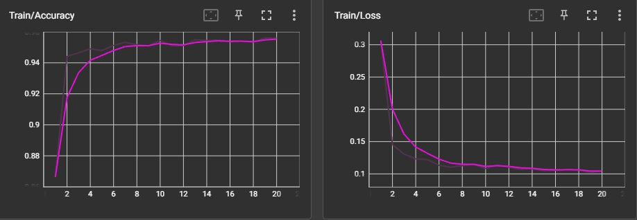
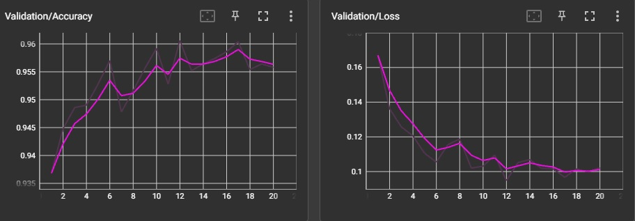
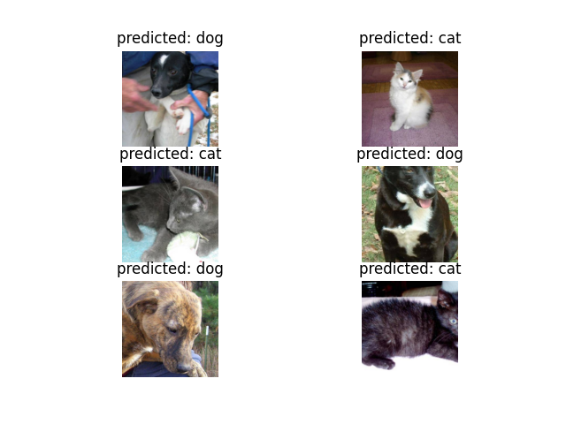
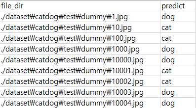

# 파이토치로 전이학습 분류 모델 만들기

## requirements
matplotlib==3.5.3
numpy==1.21.6
pandas==1.3.5
tensorboard==2.10.0
torch==1.12.1+cu113
torchvision==0.13.1+cu113

## 학습 예시
python train.py --model_fn resnet.pth --gpu_id 0 --n_epochs 20 --model_name resnet --n_classes 2 --freeze --use_pretrained

## 학습 결과

## 예측 예시
python predict.py --model_fn resnet.pth --gpu_id 0

## 예측 결과
- **예측 결과 시각화**  
  
- **결과 csv파일**  
  
